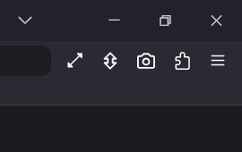
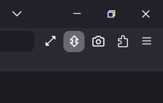

# Firefox Auto-hide Toolbars
Adds a toolbar button that toggles automatic toolbar hiding in Firefox.
This project is based on userChromeJS/userChrome.css and integrates with fx-autoconfig.

## Features
* Toolbar button
* Tools menu entry
* Ctrl + F11 shortcut
* Native Firefox fullscreen preserved
* Automatic toolbar hiding
* Automatic toolbar restoration on hover
* Button state synchronized with the current mode
* Diagnostic command available from Browser Console

## Screenshots

### Toolbar button OFF (Auto-hide disabled)


### Toolbar button ON (Auto-hide enabled)


## Requirements
* Firefox
* fx-autoconfig

Official project:
https://github.com/MrOtherGuy/fx-autoconfig

## Downloads

Download the latest release here:
https://github.com/John2022/firefox-auto-hide-toolbars/releases/latest

### Full package
Recommended for most users.
Contains:
* Program package
* Profile package
* Documentation

### Source-only package
For advanced users already using fx-autoconfig.
Contains only:
* userChrome.css
* autohide_toolbox_toggle.uc.js
* autohide-bars.svg

## Diagnostic
Open Browser Console:
CTRL + SHIFT + J
Run:
```js
FirefoxAutoHideToolboxStatus()
```

## Credits
Based on:
MrOtherGuy's fx-autoconfig
https://github.com/MrOtherGuy/fx-autoconfig

Additional code and modifications:
John2022

## License
Mozilla Public License Version 2.0 (MPL-2.0)
